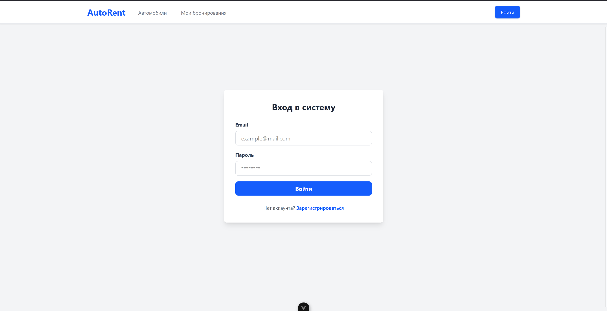
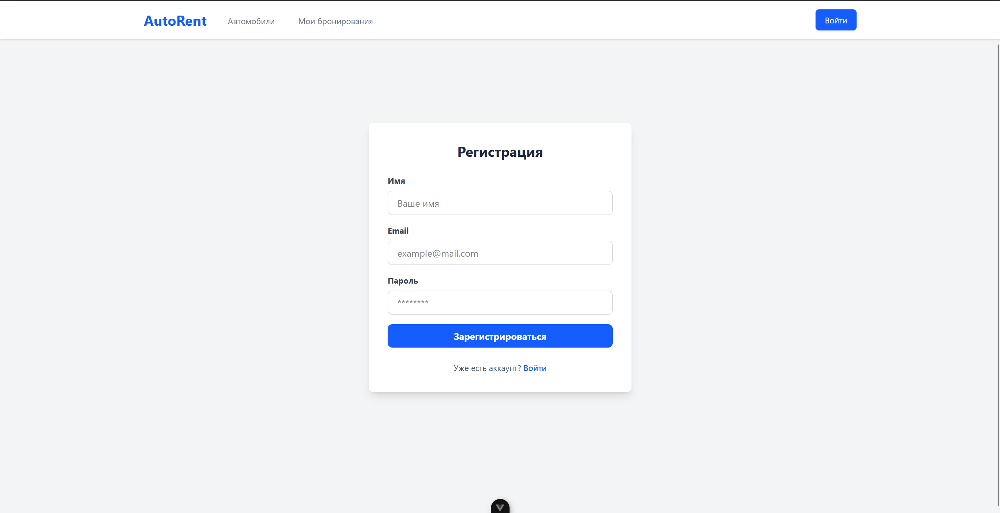
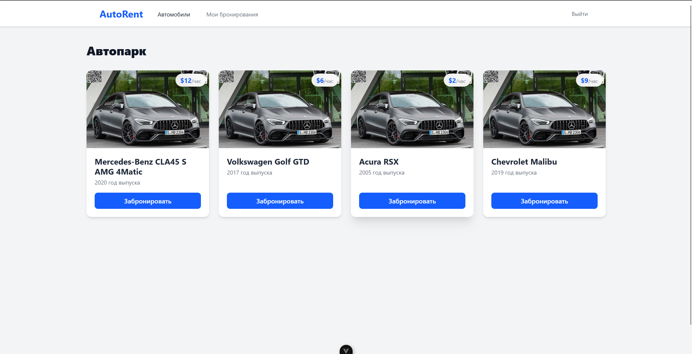
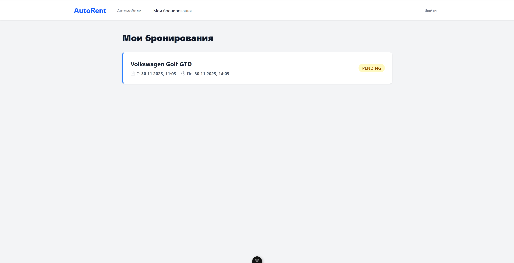

# 📄 **README.md — Autorent Frontend**

# 🚗 Autorent Frontend (Vue 3 + TypeScript)

Фронтенд-приложение для сервиса аренды автомобилей **Autorent**.
Построено на основе:

* **Vue 3**
* **TypeScript**
* **Vite**
* **Tailwind CSS**
* **DaisyUI**
* **Axios**
* **JWT Authentication**

Приложение использует API из [backend-проекта Autorent](https://github.com/Arlan-Z/autorent-frontend) и предоставляет удобный UI для авторизации, просмотра машин, бронирований и управления учетной записью.

---

# 📸 Скриншоты

### 🔐 Страница авторизации



### 📝 Страница регистрации



### 🚘 Список машин



### 📅 Мои бронирования



---

# 📦 Установка и запуск

## 1. Клонирование репозитория

```bash
git clone https://github.com/Arlan-Z/autorent-frontend
cd autorent-frontend
```

## 2. Установка зависимостей

```bash
npm install
```

## 3. Запуск в режиме разработки

```bash
npm run dev
```

По умолчанию:
👉 [http://localhost:5173](http://localhost:5173)

---

# 🗂 Структура проекта

```
src/
  api/
    axios.ts       — глобальный клиент Axios
    auth.ts        — запросы авторизации
    cars.ts        — запросы машин
    booking.ts     — запросы бронирований

  components/
    Navbar.vue

  views/
    LoginView.vue
    RegisterView.vue
    CarsView.vue
    MyBookingsView.vue

  router/
    index.ts       — маршрутизация, защита роутов

  store/
    auth.ts        — реактивное хранилище токена

  types/
    Car.ts
    Booking.ts

  assets/
    main.css       — Tailwind
```

---

# 🔧 Основной функционал

### ✔ Авторизация

* вход по email + пароль
* регистрация нового пользователя
* токен сохраняется в хранилище

### ✔ Просмотр автомобилей

* сетка карточек
* изображение, бренд, модель, цена
* кнопка “Забронировать”

### ✔ Бронирование автомобилей

* создаётся бронь на текущие 3 часа (демо)
* запрос отправляется с JWT

### ✔ Просмотр своих бронирований

* список всех броней пользователя
* бренд, модель, время, статус

### ✔ Навигация

* красивый Navbar
* logout
* скрывается, если пользователь не авторизован
